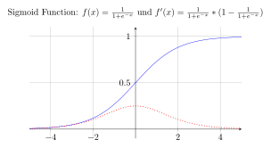
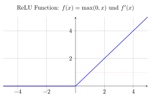

# Activation Functions - Aktivierungsfunktionen

Dieses Dokument erklärt die wichtigsten Aktivierungsfunktionen in neuronalen Netzwerken, die in `activation.ts` implementiert sind.

## Überblick

Aktivierungsfunktionen sind ein zentraler Bestandteil neuronaler Netzwerke. Sie fügen **Nicht-Linearität** hinzu und ermöglichen es dem Netzwerk, komplexe Muster zu lernen. Ohne Aktivierungsfunktionen wäre ein neuronales Netzwerk nur eine lineare Transformation - egal wie viele Schichten es hat.

## Implementierte Funktionen

### 1. Sigmoid Function (σ)



#### Mathematische Definition

```
σ(x) = 1 / (1 + e^(-x))
```

#### TypeScript Implementation

```typescript
export function sigmoid(x: number): number {
  return 1 / (1 + Math.exp(-x));
}
```

#### Eigenschaften

- **Wertebereich:** (0, 1) - Ausgabe liegt immer zwischen 0 und 1
- **Form:** S-förmige Kurve (daher der Name "Sigmoid" = S-förmig)
- **Differenzierbar:** Überall glatt und differenzierbar
- **Symmetriezentrum:** Bei x = 0 ist σ(0) = 0.5

#### Ableitung (Derivative)

```
σ'(x) = σ(x) × (1 - σ(x))
```

```typescript
export function sigmoidDerivative(x: number): number {
  const s = sigmoid(x);
  return s * (1 - s);
}
```

#### Vorteile

✅ **Probabilistische Interpretation:** Ausgabe kann als Wahrscheinlichkeit interpretiert werden  
✅ **Glatt:** Überall differenzierbar  
✅ **Bounded:** Ausgabe ist begrenzt zwischen 0 und 1

#### Nachteile

❌ **Vanishing Gradient Problem:** Gradienten werden bei extremen Werten sehr klein  
❌ **Nicht zero-centered:** Ausgabe ist nie negativ  
❌ **Rechenaufwand:** Exponentialfunktion ist teuer zu berechnen

#### Verwendung

- **Output Layer:** Ideal für binäre Klassifikation
- **Historisch:** Früher in Hidden Layers verwendet (heute weniger üblich)

---

### 2. ReLU Function (Rectified Linear Unit)



#### Mathematische Definition

```
ReLU(x) = max(0, x)
```

#### TypeScript Implementation

```typescript
export function relu(x: number): number {
  return Math.max(0, x);
}
```

#### Eigenschaften

- **Wertebereich:** [0, ∞) - Ausgabe ist nie negativ
- **Form:** Lineare Funktion für positive Werte, Null für negative
- **Einfach:** Sehr einfache Berechnung
- **Sparsity:** Produziert spärliche Aktivierungen (viele Nullen)

#### Ableitung (Derivative)

```
ReLU'(x) = { 1 wenn x > 0
           { 0 wenn x ≤ 0
```

```typescript
export function reluDerivative(x: number): number {
  return x > 0 ? 1 : 0;
}
```

**Hinweis:** Technisch ist ReLU bei x = 0 nicht differenzierbar, aber in der Praxis verwenden wir die Konvention ReLU'(0) = 0.

#### Vorteile

✅ **Einfache Berechnung:** Nur ein Vergleich und max() Operation  
✅ **Kein Vanishing Gradient:** Gradient ist 1 für x > 0  
✅ **Sparsity:** Viele Neuronen sind inaktiv (0), was effizient ist  
✅ **Biologisch plausibel:** Ähnelt der Aktivierung biologischer Neuronen

#### Nachteile

❌ **Dead Neurons:** Neuronen können "sterben" (immer 0 ausgeben)  
❌ **Nicht differenzierbar:** Bei x = 0 nicht definiert  
❌ **Unbegrenzt:** Ausgabe kann sehr große Werte annehmen

#### Verwendung

- **Hidden Layers:** Standard-Aktivierungsfunktion in modernen Deep Networks
- **Convolutional Neural Networks:** Weit verbreitet in CNNs
- **Nicht für Output Layer:** Bei Klassifikation meist andere Funktionen

---

## Vergleich der Funktionen

| Eigenschaft             | Sigmoid           | ReLU                |
| ----------------------- | ----------------- | ------------------- |
| **Wertebereich**        | (0, 1)            | [0, ∞)              |
| **Rechenaufwand**       | Hoch (exp)        | Niedrig (max)       |
| **Vanishing Gradient**  | Ja, problematisch | Nein (für x > 0)    |
| **Differenzierbarkeit** | Überall           | Überall außer x = 0 |
| **Verwendung heute**    | Output Layer      | Hidden Layers       |
| **Training Speed**      | Langsamer         | Schneller           |

## Praktische Verwendung

### In einem neuronalen Netzwerk:

```typescript
// Hidden Layer mit ReLU
const hiddenOutput = weights.map((w, i) => relu(w * input[i] + bias[i]));

// Output Layer mit Sigmoid (für binäre Klassifikation)
const prediction = sigmoid(
  hiddenOutput.reduce((sum, val, i) => sum + val * outputWeights[i], outputBias)
);
```

### Backpropagation:

**Backpropagation** ist der Algorithmus, mit dem neuronale Netzwerke lernen. Er berechnet, wie stark jedes Gewicht angepasst werden muss, um den Fehler zu minimieren.

**Grundprinzip:**

1. **Forward Pass:** Eingabe wird durch das Netzwerk geleitet
2. **Fehler berechnen:** Differenz zwischen Vorhersage und gewünschter Ausgabe
3. **Backward Pass:** Fehler wird rückwärts durch das Netzwerk propagiert
4. **Gewichte aktualisieren:** Jedes Gewicht wird entsprechend seines Beitrags zum Fehler angepasst

**Warum sind Ableitungen wichtig?**
Die Ableitung der Aktivierungsfunktion bestimmt, wie stark das Signal "durchgelassen" wird:

- **Große Ableitung:** Signal wird stark weitergegeben → schnelles Lernen
- **Kleine Ableitung:** Signal wird abgeschwächt → langsames Lernen (Vanishing Gradient)

```typescript
// Gradient berechnen
const outputGradient = sigmoidDerivative(outputValue) * error;
const hiddenGradient = hiddenValues.map(
  (val) => reluDerivative(val) * outputGradient
);
```

**Beispiel:** Bei Sigmoid wird die Ableitung für große |x| sehr klein (≈0), was das Lernen verlangsamt. Bei ReLU ist die Ableitung entweder 1 oder 0, was zu stabileren Gradienten führt.

## Historische Entwicklung

1. **Frühe Netzwerke (1980s-1990s):** Sigmoid war dominant
2. **Deep Learning Revolution (2006+):** ReLU wurde zum Standard
3. **Heute:** ReLU in Hidden Layers, spezielle Funktionen im Output Layer

## Wann welche Funktion verwenden?

### Sigmoid verwenden wenn:

- Binary Classification im Output Layer
- Wahrscheinlichkeiten als Ausgabe gewünscht
- Begrenzte Ausgabe erforderlich

### ReLU verwenden wenn:

- Hidden Layers in Deep Networks
- Schnelles Training gewünscht
- Sparsity erwünscht

## Weitere Aktivierungsfunktionen (nicht implementiert)

- **Tanh:** Ähnlich Sigmoid, aber zero-centered (-1, 1)
- **Leaky ReLU:** ReLU mit kleiner Steigung für negative Werte
- **ELU:** Exponential Linear Unit
- **Swish:** x \* sigmoid(x) - von Google entwickelt
- **GELU:** Gaussian Error Linear Unit - in Transformers verwendet

## Code-Struktur

Die Implementierung in `activation.ts` folgt funktionalen Prinzipien:

- Jede Funktion ist pure (keine Seiteneffekte)
- Klare Typisierung mit TypeScript
- Ausführliche JSDoc-Dokumentation
- Sowohl Funktionen als auch ihre Ableitungen implementiert

Dies ermöglicht eine saubere Verwendung in neuronalen Netzwerken und erleichtert die Implementierung von Backpropagation-Algorithmen.
